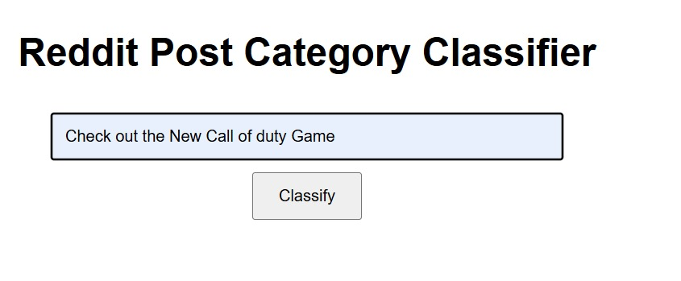

# 🧠 Reddit Post Classifier

[](https://www.python.org/)
[](https://opensource.org/licenses/MIT)
[](https://colab.research.google.com/github/Umair-Rai/Reddit-Post-Classifier/blob/main/NLP_Task_Project.ipynb)

A machine learning project that classifies Reddit post titles into broad categories such as 🎮 Gaming, 🎓 Education, 🎵 Music, and more using **TF-IDF vectorization** and a **Multinomial Naive Bayes classifier**. A minimal **Flask web interface** is also provided for user input and output visualization.

---

## 📸 Demo

**Input Sample:**



**Output Sample:**


## 🗂️ Project Structure
```
Reddit-Post-Classifier/
│
├── assets/
│   ├── 1.png                     ← Input screenshot
│   └── 2.png                     ← Output screenshot
│
├── templates/
│   ├── index.html               ← HTML form for text input
│   └── result.html              ← HTML result display
│
├── NLP_Task_Project.ipynb       ← Main Jupyter Notebook (training & testing)
├── label_encoder.pkl            ← Trained LabelEncoder
├── reddit_category_model.pkl    ← Trained Naive Bayes model
├── tfidf_vectorizer.pkl         ← TF-IDF vectorizer
├── requirements.txt             ← Python dependencies
├── web_interface.py             ← Flask web application
└── README.md                    ← You are here
```

## 🚀 Quick Start

### 🔗 Run on Google Colab

Click the badge below to run the notebook directly in Colab:

[](https://colab.research.google.com/github/Umair-Rai/Reddit-Post-Classifier/blob/main/NLP_Task_Project.ipynb)

### 🖥️ Run Locally (Jupyter Notebook)

1. **Clone the repository**
```bash
git clone https://github.com/Umair-Rai/Reddit-Post-Classifier.git
cd Reddit-Post-Classifier

##Install dependencies
pip install -r requirements.txt
Run the notebook
Open NLP_Task_Project.ipynb in Jupyter or Colab and run all cells.

Web App Interface (Flask)
This project also provides a simple Flask-based web interface.

▶️ To run the web app:
bash
Copy
Edit
python web_interface.py
🧩 Routes:
/ — Home page with text input form (served by index.html)

/predict — POST route for prediction results (served by result.html)

📦 Dependencies
All dependencies are listed in requirements.txt, including:

scikit-learn

pandas

numpy

flask

To install:

bash
Copy
Edit
pip install -r requirements.txt


👨‍💻 Author
Umair Akram
📧 umair.akramcs@gmail.com
🔗 GitHub - umair-rai

